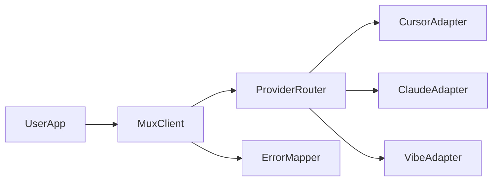

# muxai

[](https://github.com/guilyx/muxai/actions/workflows/go-ci.yml)
[](https://github.com/guilyx/muxai/actions/workflows/python-ci.yml)
[](https://github.com/guilyx/muxai/actions/workflows/rust-ci.yml)
[](https://github.com/guilyx/muxai/actions/workflows/typescript-ci.yml)
[](https://github.com/guilyx/muxai/actions/workflows/repo-quality.yml)


Muxai is a suite of SDKs that lets developers use AI agent CLIs programmatically through a single, consistent client architecture.

## Why muxai

- Single integration surface for multiple agent CLIs.
- Consistent models and error handling across providers.
- Sync and async execution patterns.
- Language-specific SDKs aligned under one architecture.
- Built for open-source collaboration and extensibility.

## Current Status

Phase 1 is Go-first:

- Go SDK has core client architecture, provider adapters, tests, and release workflow.
- Python, Rust, and TypeScript now include implemented SDK cores with matching client/provider contracts and tests.

## Supported Providers (v0)

- Cursor
- Claude
- Vibe

## Environment Configuration

Use `.env.example` as the template for local setup:

```bash
cp .env.example .env
```

Recommended variables:

- `MUXAI_DEFAULT_PROVIDER` to set default adapter selection.
- `CURSOR_API_KEY`, `CLAUDE_API_KEY`, `VIBE_API_KEY` for provider auth.
- `OPENAI_BASE_URL` and `OPENAI_API_KEY` for OpenAI-compatible endpoints (including local model gateways).

Never commit `.env`; it is gitignored by default.

## Provider Expansion Candidates

Sourced, high-signal CLI ecosystems for follow-up adapters:

- [OpenAI Codex CLI](https://developers.openai.com/codex/cli/) and [openai/codex](https://github.com/openai/codex)
- [Google Gemini CLI](https://github.com/google-gemini/gemini-cli)
- [Aider](https://github.com/Aider-AI/aider)
- [Sourcegraph Cody CLI](https://sourcegraph.com/docs/cody/clients/install-cli)

## Architecture



## Repository Layout

```text
docs/
sdk/
  go/
  python/
  rust/
  typescript/
.github/workflows/
```

## Quick Start (Go)

```go
package main

import (
    "context"
    "fmt"

    "github.com/guilyx/muxai/sdk/go/pkg/muxai"
    "github.com/guilyx/muxai/sdk/go/pkg/muxai/providers/claude"
    "github.com/guilyx/muxai/sdk/go/pkg/muxai/providers/cursor"
    "github.com/guilyx/muxai/sdk/go/pkg/muxai/providers/vibe"
)

func main() {
    client, err := muxai.NewClient(
        muxai.WithProvider(cursor.NewProvider()),
        muxai.WithProvider(claude.NewProvider()),
        muxai.WithProvider(vibe.NewProvider()),
        muxai.WithDefaultProvider(muxai.ProviderCursor),
    )
    if err != nil {
        panic(err)
    }

    resp, err := client.RunDefault(context.Background(), muxai.Request{
        Messages: []muxai.Message{
            {Role: muxai.RoleUser, Content: "Summarize this repository in 3 bullets."},
        },
    })
    if err != nil {
        panic(err)
    }

    fmt.Println(resp.Content)
}
```

## Language SDKs

- Go: [`sdk/go/README.md`](sdk/go/README.md)
- Python: [`sdk/python/README.md`](sdk/python/README.md)
- Rust: [`sdk/rust/README.md`](sdk/rust/README.md)
- TypeScript: [`sdk/typescript/README.md`](sdk/typescript/README.md)

## CI/CD

- Per-language CI is path-filtered and only runs when related folders change.
- Go CI enforces `gofmt`, `go vet`, race-safe tests, and a `>=70%` coverage gate.
- Go release runs on `go/v*` tags and publishes GitHub release artifacts.
- Repository quality checks enforce markdown hygiene and changelog presence.

## Local Developer Quality Baseline

This repository includes best-practice dotfiles and pre-commit hooks:

- `.editorconfig` for consistent whitespace and line endings.
- `.gitattributes` to normalize text files to LF.
- `.markdownlint.json` for markdown lint defaults.
- `.pre-commit-config.yaml` for local hygiene checks.

Install and run hooks:

```bash
uv tool install pre-commit
pre-commit install
pre-commit run --all-files
```

## Changelogs

- Root: [`CHANGELOG.md`](CHANGELOG.md)
- Per-SDK changelogs in each `sdk/<language>/CHANGELOG.md`
